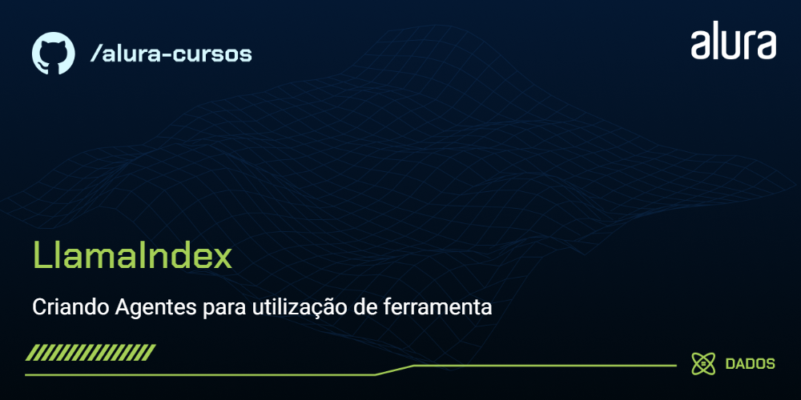

# Sistema Multiagente para Pesquisa Científica

Aplicação em Python que combina **CrewAI**, **LlamaIndex**, **RAG** e ferramentas externas para pesquisar, filtrar e consultar conteúdo científico.

O projeto foi refatorado para separar interface, agentes, ferramentas e camada de recuperação documental, aproximando a estrutura de uma aplicação Python de produção.



## O que o projeto faz

- Pesquisa artigos científicos no **arXiv**.
- Realiza pesquisa complementar na web com **Tavily**.
- Coordena agentes especializados com **CrewAI** em fluxo sequencial.
- Filtra resultados fora do tema e consolida uma resposta final em português.
- Consulta bases documentais locais com **LlamaIndex** e arquitetura **RAG**.
- Utiliza embeddings multilíngues do **Hugging Face**.
- Integra modelos via **Groq** e **NVIDIA NIM**.
- Disponibiliza uma interface interativa com **Gradio**.

## Arquitetura

```text
llamaindex-agents/
├── app.py
├── src/
│   ├── __init__.py
│   ├── agents.py
│   ├── config.py
│   ├── rag.py
│   └── tools.py
├── scripts/
│   └── build_indexes.py
├── data/
│   ├── README.md
│   ├── source_documents/
│   │   ├── articles/
│   │   └── books/
│   └── indexes/
├── downloads/
├── assets/
│   └── thumb.png
├── .env.example
├── .gitignore
├── requirements.txt
└── README.md
```

### Responsabilidades dos módulos

- **`app.py`**: interface Gradio e tratamento das chamadas da aplicação.
- **`src/agents.py`**: criação e execução dos agentes CrewAI.
- **`src/tools.py`**: integração com arXiv, Tavily e download de artigos.
- **`src/rag.py`**: carregamento dos índices e consultas com ReAct + LlamaIndex.
- **`src/config.py`**: configuração centralizada, caminhos e variáveis de ambiente.
- **`scripts/build_indexes.py`**: geração local dos índices vetoriais usados pelo RAG.

## Agentes

O fluxo de pesquisa utiliza três papéis em sequência:

1. **Agente de pesquisa no arXiv** — transforma o tema em palavras-chave científicas em inglês e procura artigos relacionados.
2. **Agente de pesquisa na web** — complementa a busca utilizando Tavily.
3. **Agente de verificação** — remove resultados fora do tema, duplicados ou sem caráter acadêmico e consolida a resposta final.

Os agentes possuem limite de iterações para reduzir loops de tool calling e evitar execuções excessivamente longas.

A aba de consulta documental utiliza um **ReActAgent** para escolher entre ferramentas de consulta das bases indexadas.

## Tecnologias

- Python
- CrewAI
- LiteLLM
- LlamaIndex
- RAG
- Groq
- NVIDIA NIM
- Hugging Face Embeddings
- Tavily
- arXiv
- Gradio

## Instalação

> Recomenda-se **Python 3.11** para evitar incompatibilidades entre dependências do ecossistema de IA.

Clone o repositório e entre na pasta:

```bash
git clone https://github.com/swehttamTOTAL90/llamaindex-agents.git
cd llamaindex-agents
```

Crie um ambiente virtual:

```bash
python -m venv .venv
```

Ative o ambiente e instale as dependências:

```bash
pip install -r requirements.txt
```

## Variáveis de ambiente

Copie `.env.example` para `.env` e adicione suas próprias chaves:

```env
GROQ_API_KEY=
NVIDIA_API_KEY=
TAVILY_API_KEY=
```

O arquivo `.env` é ignorado pelo Git e não deve ser versionado ou compartilhado.

O modelo CrewAI padrão configurado atualmente é um endpoint NVIDIA NIM definido pela variável `CREWAI_MODEL`. Caso o provedor descontinue um modelo, basta atualizar essa variável no `.env`.

## Preparando a base RAG

Por segurança e organização, documentos locais e índices gerados não são armazenados no repositório.

Adicione somente arquivos que você tenha permissão para utilizar em:

```text
data/source_documents/articles/
data/source_documents/books/
```

Depois gere os índices:

```bash
python scripts/build_indexes.py
```

## Executando

```bash
python app.py
```

A interface Gradio será iniciada localmente e disponibilizará duas áreas:

- **Pesquisa de artigos**: executa a equipe multiagente.
- **Consulta documental**: responde perguntas utilizando as bases RAG locais.

A pesquisa de artigos pode ser testada mesmo sem PDFs locais. A consulta documental exige que os índices RAG tenham sido gerados previamente.

## Melhorias realizadas na refatoração

- Separação de responsabilidades em módulos.
- Padronização das variáveis de ambiente.
- Remoção de impressão de API keys no terminal.
- Atualização do modelo padrão utilizado pelo CrewAI/NVIDIA NIM.
- Inclusão explícita do LiteLLM nas dependências.
- Fluxo multiagente sequencial para reduzir delegações e loops desnecessários.
- Limite de iterações por agente.
- Instruções mais rígidas para uso das ferramentas.
- Consultas do arXiv orientadas a palavras-chave científicas em inglês.
- Resumos do arXiv compactados para reduzir contexto e tempo de processamento.
- Tratamento mais claro de erros de configuração e ausência de índices.
- Separação entre documentos de origem e artefatos gerados.
- `.gitignore` para evitar publicação acidental de chaves, PDFs e índices locais.

## Objetivo

O projeto foi desenvolvido para explorar **IA Generativa**, **sistemas multiagentes**, **tool use** e **Retrieval-Augmented Generation (RAG)** em um fluxo aplicado à pesquisa científica.

---

Projeto de estudo e portfólio em **Dados e Inteligência Artificial**.
